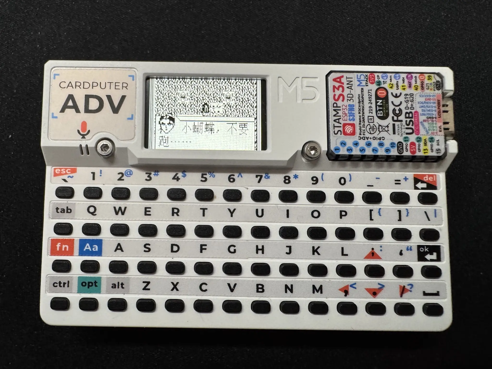

<h1 align="center">m5-fumoji</h1>

<p align="center">
<a href="README.md">English</a> | 中文
</p>

面向 **M5Stack Cardputer ADV** 的《伏魔记》原生固件，同时保留普通 Cardputer 兼容构建。固件直接在 ESP32-S3 上运行可移植的 GPL C 引擎，不使用 Java、WebView、Kotlin/JS 或动态 JavaScript 运行时。

<p align="center">

</p>

## 当前状态

固件现在已经接入完整的上游 C 游戏引擎，包括剧情、战斗、菜单、物品、魔法、商店和存档逻辑。Cardputer 适配层目前提供：

- 原作 160×96 单色帧缓冲，缩放显示到 240×135 屏幕；
- 通过 `M5Cardputer` 同时支持 ADV TCA8418 键盘和普通版矩阵键盘；
- 从 `/FMJ.LIB` 流式读取 16 KB ROM 数据银行，不把整个 ROM 放进 RAM；
- 按需读取 `/HZK16` 和 `/ASC16` 字形；
- 使用 LittleFS 保存引擎存档；
- 按需启用、带 CRC 校验的 USB 帧缓冲调试串流；
- 独立的 32 KB FreeRTOS 引擎任务；
- 运行时识别板型，包括 `board_M5CardputerADV`。

Cardputer ADV 构建已经通过，目前约占 3 MB 应用分区中的 577 KB，静态 RAM 约 124 KB。启动、剧情探索、按键、菜单、战斗、保存和冷启动读取均已在 Cardputer ADV 真机上验证通过，当前视为完整可玩的 Cardputer 移植版本。

旧的 C++ 部分解释器仍保留在 `lib/FmjCore`，供主机工具和回归测试使用；固件入口现在实际运行的是 `lib/FmjCEngine`。

## 构建与烧录

需要 [PlatformIO](https://platformio.org/)。默认目标为 Cardputer ADV：

```sh
pio run
pio run -e cardputer_adv -t upload
```

游戏资源分区需要单独上传：

```sh
pio run -e cardputer_adv -t uploadfs
```

普通 Cardputer 使用：

```sh
pio run -e cardputer -t upload
pio run -e cardputer -t uploadfs
```

导入资源后，可生成从地址 `0x0000` 烧录的 ADV 单文件镜像：

```sh
sh scripts/build_release.sh
```

输出为 `dist/m5-fumoji-cardputer-adv.bin`，其中包含 bootloader、分区表、应用程序和当前 `data/` 目录内容。

## 导入游戏数据

游戏资源不会提交到仓库。请从参考项目的本地检出版本导入：

```sh
node scripts/import_reference_assets.mjs /path/to/baye-fmj-app
```

生成的文件应为：

```text
data/FMJ.LIB
data/HZK16
data/ASC16
```

它们会分别以 `/FMJ.LIB`、`/HZK16` 和 `/ASC16` 上传到 LittleFS。

## 按键

主方向键按 Cardputer 错位键盘形成实体菱形布局：

```text
      W
Aa    A    S
```

- `W` / `Aa` / `A` / `S`：上 / 左 / 下 / 右；
- `;` / `,` / `.` / `/`：备用上 / 左 / 下 / 右；
- `Enter`：确认；
- `Del` / `Backspace`：打开游戏菜单、取消或返回；
- `Tab` 或 `M`：原 BBK 的主页键（在当前引擎中不是游戏菜单键）；
- `[` / `]` 或 `Q` / `E`：Page Up / Page Down。
- `-`：将屏幕亮度降低 10%；
- `=` 或 `+`：将屏幕亮度提高 10%。

亮度可在 10%–100% 之间调节，重启后会保留上次设置。

## 测试

运行现有主机回归测试：

```sh
pio test -e native
```

构建实际 ADV 固件：

```sh
pio run -e cardputer_adv
```

## USB 屏幕查看器

Cardputer 通过 USB 连接后，可把 160×96 帧缓冲镜像到电脑窗口：

```sh
sh scripts/view_screen.sh
```

查看器会自动识别 ESP32-S3 USB Serial/JTAG 设备，并通过 `ffplay` 进行整数倍最近邻显示。也可以手动指定串口和缩放倍数：

```sh
sh scripts/view_screen.sh --port /dev/cu.usbmodem2201 --scale 6
```

如果只需无窗口检查连接和 CRC，可接收一帧有效画面后自动退出：

```sh
sh scripts/view_screen.sh --no-display --frames 1
```

串流默认关闭。查看器连接时启用，每秒发送一次心跳，正常退出时关闭；超过 3.5 秒收不到心跳，固件也会自动停止串流。查看器运行期间不要让串口监视器同时占用同一端口。

## 上游与许可

Copyright (C) 2026 LitoMore

本项目采用 [GNU GPL version 2 only](LICENSE)（`GPL-2.0-only`）。C 引擎改编自 [`erduoniba/baye-fmj-app/Fmj/fmj_c_engine`](https://github.com/erduoniba/baye-fmj-app/tree/main/Fmj/fmj_c_engine)，固定到提交 `60c41ea2d9932b295833ece7004394497610596a`。上游 GPL-2.0 许可与精确来源记录保留在 [`lib/FmjCEngine`](lib/FmjCEngine) 中。

原游戏数据、字体、名称、图像、对白和剧情不属于本仓库 GPL 授权范围，也不会提交进源码仓库。本项目是非官方独立移植，与原游戏权利人及 M5Stack 无隶属、赞助或背书关系。

分发固件二进制时，GPL-2.0 要求同时提供完整对应源代码和构建脚本。完整闪存镜像还会嵌入 `data/` 中的文件；除非拥有这些资源的再分发许可，否则不要公开发布该镜像。详见 [THIRD_PARTY_NOTICES.md](THIRD_PARTY_NOTICES.md)。
